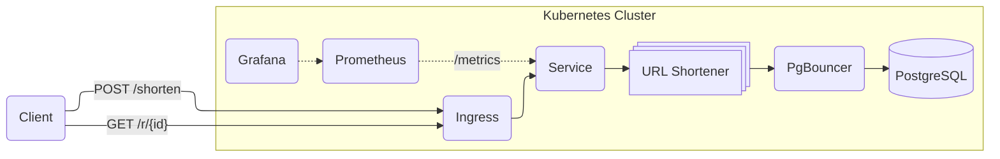

# chaos-shortener
URL shortener pet app with failure simulation tooling

```mermaid
%%{init: {"flowchart": {"defaultRenderer": "elk"}} }%%
flowchart LR
    CLIENT1@{shape: rounded, label: Client}
    INGRESS@{shape: rounded, label: Ingress}
    SVC@{shape: rounded, label: Service}
    SHORT@{shape: processes, label: URL Shortener}
    PGB@{shape: rounded, label: PgBouncer}
    DB@{shape: cyl, label: PostgreSQL}
    PROM@{shape: rounded, label: Prometheus}
    GRAF@{shape: rounded, label: Grafana}

    CLIENT1 -- GET /r/{id} --> INGRESS
    CLIENT1 -- POST /shorten --> INGRESS

    subgraph K8S[Kubernetes Cluster]
        PGB --> DB
        INGRESS --> SVC
        SVC --> SHORT
        SHORT --> PGB

        PROM -. /metrics .-> SVC
        GRAF -.-> PROM
    end
```
